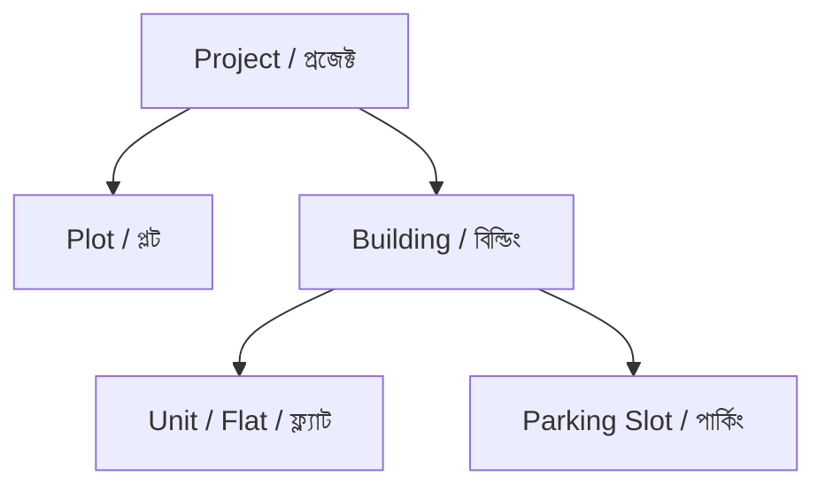

# 📋 রিয়েল এস্টেট প্রজেক্ট ও ওয়েবসাইট ডেটা কালেকশন ডিক্লারেশন (Project & Website Data Requirements)

এই ডকুমেন্টে আমাদের ওয়েবসাইট এবং অ্যাডমিন ড্যাশবোর্ডে নতুন প্রজেক্ট, প্লট, বিল্ডিং, ফ্ল্যাট/ইউনিট এবং পার্কিং যুক্ত করার জন্য কি কি তথ্য ও মিডিয়া ফাইল (ছবি) প্রয়োজন তা বিস্তারিতভাবে উল্লেখ করা হলো।

---

## 📌 সূচিপত্র (Table of Contents)
1. **ওয়েবসাইটের পেজসমূহ ও ব্যানার ইমেজের সাইজ তালিকা (Website Pages & Banner Dimensions)**
2. **প্রজেক্ট হায়ারার্কি ও প্রয়োজনীয় ডাটা স্পেসিফিকেশন (Data Hierarchy & Specifications)**
   - ১. প্রজেক্টের তথ্য (Project Level Data)
   - ২. প্লটের তথ্য (Plot Level Data)
   - ৩. বিল্ডিংয়ের তথ্য (Building Level Data)
   - ৪. ফ্ল্যাট/ইউনিটের তথ্য (Unit / Flat Level Data)
   - ৫. পার্কিং স্লটের তথ্য (Parking Slot Level Data)
3. **কোম্পানির প্রজেক্টসমূহের তালিকা ও ডাটা প্রদান নির্দেশনা (Company Projects Data Checklist)**

---

## 🌐 ১. ওয়েবসাইটের পেজ ব্যানার ও সাইজ বিবরণ (Website Pages & Banner Dimensions)

ওয়েবসাইটের বিভিন্ন পেজে প্রদর্শনের জন্য প্রতিটি পেজের অনুকূলে হাই-রেজুলেশন ব্যানার ছবি প্রয়োজন। নিচে ব্যানারগুলোর রেশিও ও প্রস্তাবিত পিক্সেল সাইজ দেওয়া হলো:

* **ডেস্কটপ রেশিও (Desktop Banner Ratio):** `4:1` (দৈর্ঘ্য : উচ্চতা) ➔ **সুপারিশকৃত সাইজ:** `1920 x 480 px` (সর্বনিম্ন `1280 x 320 px`)
* **মোবাইল রেশিও (Mobile Banner Ratio):** `16:9` ➔ **সুপারিশকৃত সাইজ:** `1280 x 720 px`

### **পেজ তালিকা ও ব্যানার ইমেজের বিবরণ:**

| পেজের নাম (Page Name) | ইউআরএল / লিংক (URL Route) | ব্যানারের রেশিও (Aspect Ratio) | সাইজ (Recommended Dimensions) | যে ধরণের ছবি লাগবে (Description) |
| :--- | :--- | :--- | :--- | :--- |
| **Home Page (হিরো স্লাইডার)** | `/` | `1920:800` বা `16:9` | `1920 x 800 px` | হোম পেজের মূল আকর্ষণীয় স্লাইডার ব্যানার ছবি। |
| **About Us (আমাদের কথা)** | `/about` | `4:1` (Desktop) / `16:9` (Mobile) | `1920 x 480 px` | কোম্পানির পরিচয়, ঐতিহ্য ও ব্র্যান্ডিং সম্পর্কিত ব্যানার। |
| **Services (সেবাসমূহ)** | `/services` | `4:1` (Desktop) / `16:9` (Mobile) | `1920 x 480 px` | রিয়েল এস্টেট ও কনস্ট্রাকশন সার্ভিস সংক্রান্ত ব্যানার। |
| **Projects (সকল প্রজেক্ট)** | `/project` | `4:1` (Desktop) / `16:9` (Mobile) | `1920 x 480 px` | বহুতল ভবন ও রেসিডেন্সিয়াল প্রজেক্টের লিস্ট ব্যানার। |
| **Land Projects (জমি/ল্যান্ড প্রজেক্ট)** | `/land-project` | `4:1` (Desktop) / `16:9` (Mobile) | `1920 x 480 px` | ল্যান্ড প্রজেক্ট এবং প্লটিং প্রজেক্টের ব্যানার। |
| **Landowner / Joint Venture** | `/landowner` | `4:1` (Desktop) / `16:9` (Mobile) | `1920 x 480 px` | জমিদারদের সাথে যৌথ উদ্যোগের (JV) প্রচারণামূলক ব্যানার। |
| **Contact Us (যোগাযোগ)** | `/contact` | `4:1` (Desktop) / `16:9` (Mobile) | `1920 x 480 px` | কাস্টমার সাপোর্ট ও যোগাযোগের ব্যানার। |
| **Career (ক্যারিয়ার)** | `/career` | `4:1` (Desktop) / `16:9` (Mobile) | `1920 x 480 px` | নিয়োগ ও জব সার্কুলার পেজের ব্যানার। |
| **Agent List (এজেন্ট তালিকা)** | `/agent-list` | `4:1` (Desktop) / `16:9` (Mobile) | `1920 x 480 px` | এজেন্সী বা সেলস পার্টনারদের পেজের ব্যানার। |
| **Media Center / Insights (ব্লগ)** | `/insights` | `4:1` (Desktop) / `16:9` (Mobile) | `1920 x 480 px` | নিউজ, প্রেস রিলিজ ও আর্টিকেলের হেডার ব্যানার। |
| **Customer Enquiry (অনুসন্ধান)** | `/customer` | `4:1` (Desktop) / `16:9` (Mobile) | `1920 x 480 px` | কাস্টমার এনকোয়ারি ফর্ম পেজের ব্যানার। |
| **Terms & Conditions (শর্তাবলী)** | `/terms-conditions` | `4:1` (Desktop) / `16:9` (Mobile) | `1920 x 480 px` | টার্মস এন্ড কন্ডিশনস পেজের ব্যানার। |
| **Privacy Policy (গোপনীয়তা নীতি)** | `/privacy-policy` | `4:1` (Desktop) / `16:9` (Mobile) | `1920 x 480 px` | প্রাইভেসি পলিসি পেজের ব্যানার। |

---

## 🏗️ ২. প্রজেক্টের মূল ডাটা স্ট্রাকচার ও প্রয়োজনীয় তথ্যসমূহ

ওয়েবসাইটে যেকোনো প্রজেক্ট সঠিকভাবে সাজাতে ডাটাগুলো নিচের পর্যায়ক্রমিক স্ট্রাকচারে (Hierarchy) জমা দিতে হবে:

### 🏢 ১. প্রজেক্ট পর্যায় (Project Level Data):
প্রতিটি প্রজেক্ট যুক্ত করার সময় নিম্নলিখিত তথ্যসমূহ প্রদান করতে হবে:
* **Project Name (প্রজেক্টের নাম):** প্রজেক্টের অফিশিয়াল নাম।
* **Project Status (স্ট্যাটাস):** প্রজেক্টটি অ্যাক্টিভ (Active) নাকি ইন-অ্যাক্টিভ (Inactive)।
* **Product Type (প্রোডাক্টের ধরন):** প্রজেক্টের বর্তমান অবস্থা — রানিং (Running), আপকামিং (Upcoming) নাকি সম্পন্ন (Completed)।
* **Location (ঠিকানা):** প্রজেক্টটি কোথায় অবস্থিত তার পূর্ণাঙ্গ ঠিকানা।
* **Google Map Link (গুগল ম্যাপ লিংক):** প্রজেক্টের সঠিক গুগল ম্যাপ লোকেশন লিংক।
* **Project Banner Image:** প্রজেক্ট ডিটেইলস পেজের মূল ব্যানার ছবি (`1920 x 480 px` বা `4:1` রেশিও)।
* **Project Thumbnail Image:** প্রজেক্ট কার্ডে দেখানোর জন্য পোর্ট্রেট ছবি (`600 x 800 px` বা `3:4` রেশিও)।

---

### 🏞️ ২. প্লট পর্যায় (Plot Level Data):
যদি কোনো ল্যান্ড প্রজেক্ট বা জমির প্রজেক্ট হয়, তবে তার অধীনে প্লটের তথ্যগুলো লাগবে:
* **Project Name:** এটি কোন প্রজেক্টের অধীনে অবস্থিত।
* **Plot No.:** প্লটের নির্দিষ্ট নম্বর বা আইডি (যেমন: Plot 001)।
* **Land Area (Sqft):** প্লটের মোট আয়তন (বর্গফুটে)।
* **Price (BDT):** প্লটের নির্ধারিত মোট মূল্য (টাকায়)।
* **Status:** প্লটটি কি বিক্রির জন্য উপলব্ধ (Active) নাকি বুকড/বন্ধ (Inactive)।
* **Plot Image/Layout:** প্লটের লেআউট ম্যাপ বা ছবি (`1200 x 675 px` বা `16:9` রেশিও)।

---

### 🏬 ৩. বিল্ডিং পর্যায় (Building Level Data):
কোনো প্রজেক্ট বা প্লটের আওতায় বহুতল বিল্ডিং যুক্ত করতে গেলে নিচের তথ্যগুলো লাগবে:
* **Building Code:** বিল্ডিংয়ের ইউনিক আইডেন্টিফায়ার কোড।
* **Project Name & Plot No.:** বিল্ডিংটি কোন প্রজেক্ট এবং কোন প্লট নম্বরে অবস্থিত।
* **Building Name:** বিল্ডিংয়ের নির্দিষ্ট নাম (যেমন: Maple Court)।
* **Building Area (Decimal & Sqft):** বিল্ডিংয়ের মোট জমির পরিমাণ (শতাংশে এবং বর্গফুটে)।
* **Type of Building:** বিল্ডিংয়ের ধরন — রেসিডেন্সিয়াল (Residential), কমার্শিয়াল (Commercial) নাকি মিক্সড (Mixed)।
* **Visibility Status:** অ্যাক্টিভ (Active) নাকি ইন-অ্যাক্টিভ (Inactive)।
* **Description:** বিল্ডিংয়ের বিস্তারিত সুবিধা ও নান্দনিক বর্ণনা।
* **Features & Amenities (সুবিধাসমূহ):** বিল্ডিংয়ে বিদ্যমান সুবিধার তালিকা — যেমন: লিফট (Elevator), পার্কিং (Parking), ২৪/৭ সিকিউরিটি (Security), সুইমিং পুল (Swimming Pool), জিম (Gym), খেলার মাঠ (Playground), বাগান (Garden), সিসিটিভি (CCTV), জেনারেটর (Generator), পানি সরবরাহ (Water Supply), ওয়াইফাই (Wifi), ফায়ার সেফটি (Fire Safety), কমিউনিটি হল (Community Hall), ছাদ (Rooftop), ট্যারেস (Terrace), এবং স্টোরেজ (Storage)।
* **Building Gallery Images:** বিল্ডিংয়ের অভ্যন্তরীণ ও বাহ্যিক একাধিক গ্যালারি ছবি এবং প্রতিটির শিরোনাম।
* **Feature & Banner Image:** বিল্ডিংয়ের ফিচারড ছবি (`1200 x 675 px`) এবং ব্যানার ছবি (`1920 x 480 px` বা `4:1` রেশিও)।

---

### 🏠 ৪. ফ্ল্যাট/ইউনিট পর্যায় (Unit / Flat Data Requirements):
বিল্ডিংয়ের মধ্যে থাকা প্রতিটি ফ্ল্যাট বা ইউনিটের জন্য যা তথ্য লাগবে:
* **Building Name:** ফ্ল্যাটটি কোন বিল্ডিংয়ের অন্তর্ভুক্ত।
* **Unit Name/Type:** ইউনিটের নাম বা টাইপ (যেমন: Type A, Deluxe, Flat 4B)।
* **Gross Area & Usable Area (Sqft):** ইউনিটের মোট আয়তন এবং ব্যবহারযোগ্য আয়তন।
* **Unit Quantity:** এই টাইপের মোট কতটি ইউনিট রয়েছে।
* **Per Unit Amount & Discount (BDT):** ফ্ল্যাটের নির্ধারিত মূল্য এবং ছাড়ের পরিমাণ।
* **UDL Area (dec):** ইউডিএল এরিয়া (যদি থাকে)।
* **Status:** বিক্রিযোগ্য (Active) নাকি বুকড (Inactive)।
* **Specifications (ঘরের সংখ্যা):** ফ্ল্যাটের বেডরুম সংখ্যা, বাথরুম সংখ্যা, এবং বারান্দার সংখ্যা।
* **Agreement Text:** ইউনিটের চুক্তি ও নিয়মাবলী সংক্রান্ত টেক্সট।
* **Unit Thumbnail & Gallery Images:** ফ্ল্যাটের থাম্বনেল ছবি (`800 x 600 px`) এবং বেডরুম, ড্রয়িং, কিচেন ও ওয়াশরুমের গ্যালারি ছবিসমূহ।
* **Installment Details:** ডাউনপেমেন্ট, বুকিং মানি এবং কিস্তির তথ্য।

---

### 🚗 ৫. পার্কিং স্লট পর্যায় (Parking Slot Data Requirements):
বিল্ডিংয়ের পার্কিং লটের তথ্য:
* **Building Name:** পার্কিংটি কোন বিল্ডিংয়ের অন্তর্ভুক্ত।
* **Parking Quantity:** মোট পার্কিং স্লট সংখ্যা।
* **Parking Type:** পার্কিংয়ের ধরন — কার পার্কিং (Car), বাইক পার্কিং (Bike), নাকি বড় গাড়ি/এসইউভি (SUV)।
* **Per Parking Area (sqft) & Amount (BDT):** প্রতি পার্কিংয়ের আয়তন ও নির্ধারিত মূল্য।
* **Status:** খালি (Active) নাকি বরাদ্দকৃত (Inactive)।
* **Features:** কভার্ড পার্কিং, সিসিটিভি ক্যামেরা, ২৪/৭ সিকিউরিটি গার্ড, সহজ যাতায়াত পথ এবং ফায়ার সেফটি।
* **Parking Image:** পার্কিং লেআউট বা পার্কিং এলাকার ছবি (`1200 x 675 px`)।

---

## 🏢 ৩. কোম্পানির প্রজেক্টসমূহের তালিকা ও ডাটা প্রদান নির্দেশনা

আমাদের **Promise Assets Limited** এর অধীনে থাকা নিচের ৭টি প্রজেক্টের প্রতিটির ক্ষেত্রে ওপরে উল্লেখিত **সকল ডাটা (Project, Plot, Building, Unit/Flat এবং Parking Slot)** পর্যায়ক্রমিকভাবে সংগ্রহ ও প্রদান করতে হবে:

### 📌 প্রজেক্ট তালিকা (List of Projects):

1. **Promise Haven City**  
   📍 *লোকেশন:* Uttara, Uttarkhan, Dhaka  
   👉 *প্রয়োজনীয় ডাটা:* এই প্রজেক্টের **Project Level Data**, আওতাধীন **Plot Data**, **Building Data**, প্রতিটি **Unit/Flat Data** এবং **Parking Slot Data** প্রদান করতে হবে।

2. **Promise Height**  
   📍 *লোকেশন:* Shahid Minar Road, Kallayanpur, Dhaka  
   👉 *প্রয়োজনীয় ডাটা:* এই প্রজেক্টের **Project Level Data**, আওতাধীন **Building Data**, ফ্ল্যাট/টাইপ অনুযায়ী **Unit Data** এবং **Parking Slot Data** প্রদান করতে হবে।

3. **The Promise Hotel & Resort**  
   📍 *লোকেশন:* Inani, Cox’s Bazar  
   👉 *প্রয়োজনীয় ডাটা:* এই প্রজেক্টের **Project Level Data**, রিসোর্ট ও কটেজের **Building Data**, স্যুট/কক্ষ অনুযায়ী **Unit Data** এবং সুবিধা ও গ্যালারি ছবি প্রদান করতে হবে।

4. **Promise Trade Center**  
   📍 *লোকেশন:* Uttara, Sector 18, Diabari, Dhaka  
   👉 *প্রয়োজনীয় ডাটা:* এই প্রজেক্টের **Project Level Data**, কমার্শিয়াল **Building Data**, শপ/অফিস অনুযায়ী **Unit Data** এবং **Parking Slot Data** প্রদান করতে হবে।

5. **Promise Highway City**  
   📍 *লোকেশন:* Modonpur, Sonargaon  
   👉 *প্রয়োজনীয় ডাটা:* এই প্রজেক্টের **Project Level Data**, প্রজেক্টের মাস্টার প্ল্যান, আওতাধীন সকল **Plot Data** (স্কয়ারফিট, কাঠা ও প্লট ম্যাপ) প্রদান করতে হবে।

6. **Promise Birulia City**  
   📍 *লোকেশন:* Birulia, Savar, Dhaka  
   👉 *প্রয়োজনীয় ডাটা:* এই প্রজেক্টের **Project Level Data**, প্রজেক্ট লেআউট ও আওতাধীন সকল **Plot Data** (স্কয়ারফিট, কাঠা, মূল্য ও লেআউট ছবি) প্রদান করতে হবে।

7. **Promise Tower**  
   📍 *লোকেশন:* Road 1, Plot no. 1&3, Uttara, Sector 17/E, Dhaka  
   👉 *প্রয়োজনীয় ডাটা:* এই প্রজেক্টের **Project Level Data**, টাওয়ারের **Building Data**, টাইপ ভিত্তিক **Unit/Flat Data** এবং **Parking Slot Data** প্রদান করতে হবে।

---

*উপরে উল্লিখিত প্রতিটি প্রজেক্টের সম্পূর্ণ ডাটা পাওয়ার সাথে সাথেই সিস্টেমে যুক্ত করে ওয়েবসাইট ও পোর্টালে লাইভ করা হবে।*
